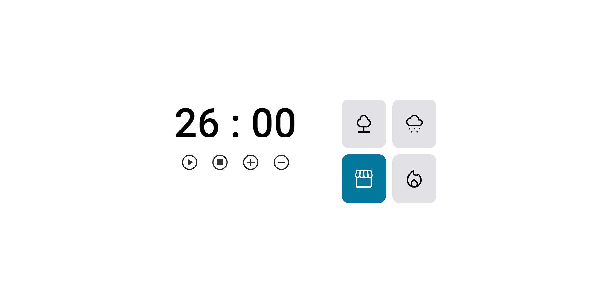
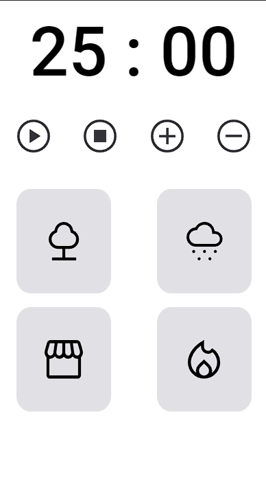

    <h1>Timer Pomofocus</h1>
    <h2> pomofocus e uma aplicação como cronômetro nas suas tarefas diarias.</h2> 

  

    <h3> Status: 🚀 Finished </h3>

 

# About

 Desafio concluido - Além de Cronômetro, tem algumas funções de músicas para te ajudar a focar na suas tarefas diarias. 

 

# Installation

### To Install this project, follow the steps above:

#### https://github.com/ElisbertoJunior/Pomofocus2.0

 

# Features 
- [x]  Cronômetro
- [x]  Botões de controles
- [x]  Músicas para escolher enquanto o foca na sua tarefa

 

# DEMO 

<h1 align="center">
    
    
    
</h1>